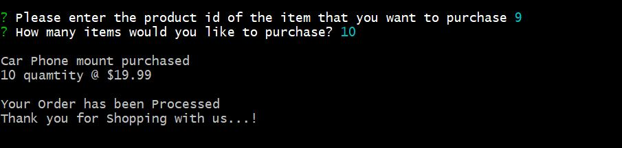
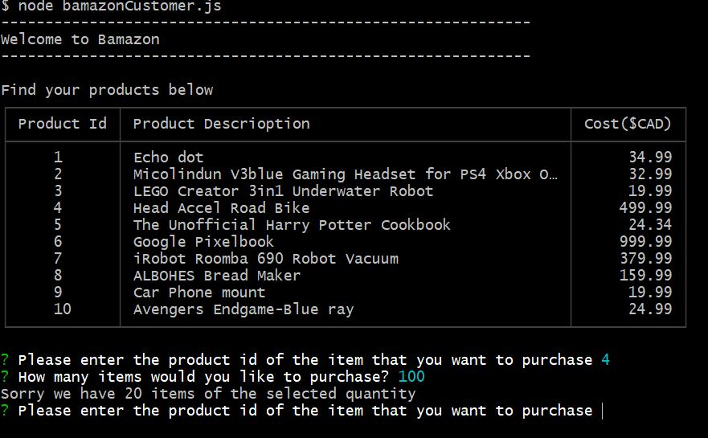

# Bamazon
### Overview
Bamazon is like Amazon storefront app. This app will interact with bamazon database and take the orders from customer and deplete stock from the store's inventory.

### This App is built With following npm Installations  and Programming languages

* [Node.js] (https://nodejs.org/en/)

* [JavaScript] (https://www.javascript.com/)

* [mysql]  (https://www.npmjs.com/package/mysql)

* [inquirer] (https://www.npmjs.com/package/inquirer)

### Command to run the App

1. node bamazonCustomer.js 

 * Running this application will first display all of the items available for sale. 

   It includes 

* Id's
* Product names
* Product prices fro sale

2. Then customer will enter the product id from available sale Items and then app will ask for the required quantity.If the requested quantity is available then the app will take the order other wise it will display the message of available quantity.

